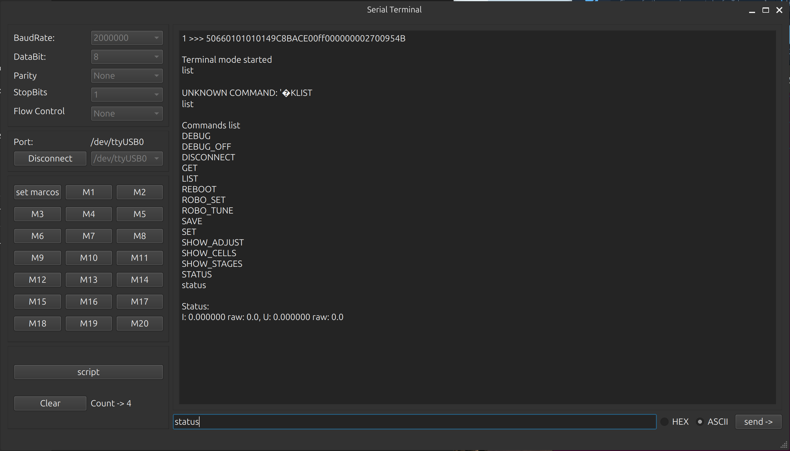
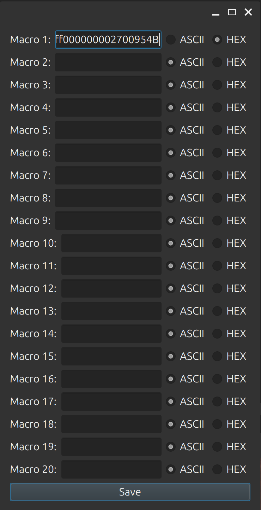

# Terminal v1.9b

**Terminal** is a useful tool for connecting to devices using an RS-232 cable. It provides an easy way to connect, set up, and fix problems with your devices. You can also automate commands using macros and scripts.

---

## Main Screen



---

## Main Features

- **Connect to ports** using different connection speeds.
- **Automatically find available ports** to connect to.
- **Macros** — save and use your frequently needed commands.
- **Scripting Language (TSC)** — write scripts to automate tasks with your devices.

---

## Macros



You can create, edit, and use macros. This lets you send common commands quickly without typing them every time.

---

## Scripting Language (TSC)

Terminal v1.9b has its own scripting language called **TSC (Terminal Script)**. You can write scripts to control your devices automatically. Here is an example script that changes settings on a device:

```pascal
//******************************
// Terminal Script
// Created: 10.11.2004 12:30:44
//******************************
program test;
var command: string;
    i: integer;
begin

  command:='' + #13;
  comsendstr(command);
  Delay(500); // wait 500 milliseconds

  command:='ROBO_SET AIN 0 1' + #13; // Set target current
  comsendstr(command);
  Delay(500); // wait 500 milliseconds
  
  command:='ROBO_TUNE AIN 0 1 0' + #13;
  comsendstr(command);
  Delay(500); // wait 500 milliseconds
      
  command:='SET MODBUS_TIMEOUT 3000' + #13; // Set MODBUS timeout
  comsendstr(command);
  Delay(500); // wait 500 milliseconds

  command:='SET MODBUS_ADDRESS 2' + #13;
  comsendstr(command);
  Delay(500); // wait 500 milliseconds

  command:='SAVE' + #13;
  comsendstr(command);
  Delay(500); // wait 500 milliseconds

end.
```

### Main Script Commands:

- `comsendstr()` — send a text string to the device.
- `Delay()` — wait for a number of milliseconds.
- Supports variables, loops, and conditions (depending on the version).

---

## Supported Functions

- Connection via **RS-232**.
- Choose connection speed: 9600, 19200, 38400, 57600, 115200, etc.
- **Find available COM ports**.
- Send and receive data as text or binary.
- Save a log of your session.
- Support for **macros** and **scripts**.
- Connection status lights (LED indicators).

---


## Build and Run

To build this project you need:

- Qt 6.x
- CMake 3.16+ or qmake
- A C++23 compiler

```bash
mkdir build
cd build
cmake ..
make
./terminal_v1.9b
```
---

**Author:** [Keith B]  
**Version:** 1.0
